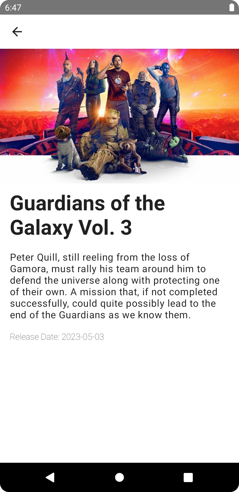

## AndroidTMDB App

This is a simple Android app that uses the [TMDB API](https://www.themoviedb.org/documentation/api) to display a 
continuous list of latest movies from the beginning of the year to the current date and their details.

Also enables searching for movies by title on the already fetched list.

*Pre-requisites*
- Built on A.S Hedgehog 2023.1.1 Canary 7
- JDK 17
- Access token from TMDB. See [here](https://developers.themoviedb.org/3/getting-started/introduction) for more details.Once received
place it in the local.properties file as follows:
``` properties
TMDB_ACCESS_TOKEN=YOUR_ACCESS_TOKEN
```

### Architecture

The project is built with clean architecture principles in mind and is split into different layers.
- **Core**: Contains the models/data classes that are independent of any framework specific dependencies and represent the business logic.
- **Data**: Contains data sources , local or remote, this is where the implementation for such is kept. All data related actions and formatting happens in this layer as well.
- **DI**: This acts as the glue between the core ,data and UI.The UI relies on the core models and interfaces which are implemented in data.
- **UI**: Contains the presentation layer of the app, the screen components and viewmodels. Framework specific dependencies are best suited for this layer.
In this layer MVI is also used, it looks similar to MVVM but the difference is the actions from a screen a.k.a intents e.g ```MovieScreenIntent``` are predefined and are finite,making the
the screen state a bit more predictable and it's easier to scan through what actions are possible from a given screen.This also makes it a bit easier to test and having one source of truth for the screen state.

### Testing

The project is currently unit tested on 3 levels
1. The UseCase layer with business specific need such as filtering for specific movie details
2. The Repository layer on integration with data sources and emission of data and errors.
3. The UI layer on the viewmodels and their states.

### Libraries

  *UI*
- [Compose](https://developer.android.com/jetpack/compose)
- [Coil](https://coil-kt.github.io/coil/compose/https://coil-kt.github.io/coil/compose/)

  *Data*
- [Retrofit](https://square.github.io/retrofit/)
- [OkHTTP](https://square.github.io/okhttp/)
- [kotlinx.serialization](https://kotlinlang.org/docs/serialization.html)

  *Testing*
- [Junit](https://junit.org/junit4/)
- [Mockk](https://mockk.io/)
- [Truth](https://truth.dev/)
- [Turbine](https://github.com/cashapp/turbine)

  *DI*
- [Hilt(DI)](https://developer.android.com/training/dependency-injection/hilt-android)

### Extras

*Pagination*

For now it uses a simple pagination strategy where we maintain a page number and increment it on each request.
We then store the list in memory in a set and append on each new request for a smooth scrolling experience.

*Design System*
The design system contains widgets and themes that are used across the app and is built with Compose.
This provides reusable components that will save development time and also provide a consistent look and feel across the app.

### Todos

- Implement a favorites feature.
- Setup a CI/CD pipeline with release & debug builds, code coverage, linting, and static analysis
- Implement local caching of data using Room.
- Animation of the UI.
- UI/E2E tests
- Crash reporting

### Screenshots(Light Theme)

| Movie List | Movie Details | Empty State                                 | Search Screen                                   | Search Screen    (Empty)                              |
|------------|---------------|---------------------------------------------|-------------------------------------------------|-------------------------------------------------------|
|||  |  |  |

### Screenshots(Dark Theme)

| Movie List                                     | Movie Details                                        | Empty State                                          | Search Screen                                        | Search Screen    (Empty)                                   |
|------------------------------------------------|------------------------------------------------------|------------------------------------------------------------|------------------------------------------------------|------------------------------------------------------------|
|  |  | |  |  |


### LICENSE

```
   Copyright 2023 David Odari

   Licensed under the Apache License, Version 2.0 (the "License");
   you may not use this file except in compliance with the License.
   You may obtain a copy of the License at

       http://www.apache.org/licenses/LICENSE-2.0

   Unless required by applicable law or agreed to in writing, software
   distributed under the License is distributed on an "AS IS" BASIS,
   WITHOUT WARRANTIES OR CONDITIONS OF ANY KIND, either express or implied.
   See the License for the specific language governing permissions and
   limitations under the License.
   
```
